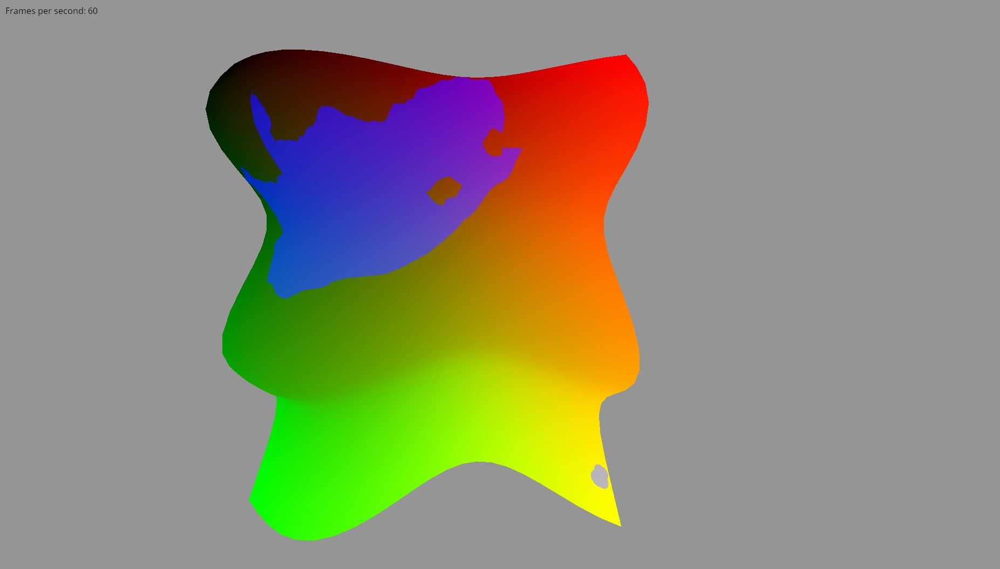

# gfx\_draping


> An example of this crate in action. An array of polygons (*not a texture!*)
> are rendered on a sinusoidal terrain.
>
> Note how the polygons rise and fall with the terrain, and can be partially
> occluded by a bump/mountain in the way.



> Another example, showing the Republic of South Africa. Note the hole in the
> mainland part of the country (which is where South Africa borders the Kingdom
> of Lesotho, a separate country), and the distant Marion Islands at the bottom
> right.
>
> This library is designed to be easy to use with GIS data, but you can easily
> construct polygons manually too.

This is a library for helping you draw polygons on a terrain. It uses a
screen-space algorithm based on the depth and stencil buffers. Performance is
affected only by the complexity of the polygons you're drawing, not the terrain
it's drawn on.

This library is a Rust implementation the algorithm described by [Schneider &
Klein (2007)][sch2007], titled "Efficient and Accurate Rendering of Vector Data
on Virtual Landscapes".

The first screenshot was taken from this minimalist demo:

```bash
# You'll want to zoom out to see anything. Do that by holding down CTRL and
# dragging down with your mouse. Then pan around with shift+drag.
cargo run --example demo
```

The second screenshot was taken from the `south_africa` demo, which demonstrates
how to combine this library with GIS data:

```bash
# See instructions above on how to use the camera. Be sure to use --release,
# otherwise you won't get a smooth, 60 fps experience.
cargo run --release --example south_africa
```

## Can I use this library?

You can, as long the following things are true:

* You are using `gfx` to do your graphics.
    * For now, only OpenGL is supported. But this is not a for any deep reason;
      it's just that the relevent shaders haven't been written. If you would
like to use another backend, PRs will kindly be accepted. :smile:
* You use the Z-Axis for your "up" in world-space -- that is, mountains go in
  the positive Z direction, and valleys go in the negative Z direction.

## How do I use this library?

See [the top-level documentation](https://docs.rs/gfx_draping/) for high-level
guidance on how you'd use this crate.

## TODO:

If any of these problems interest you, open an issue or contact me, and I can
give you a hand. Or just open a PR if you're bold! :smile:

* Add support for non-OpenGL backends.
* Implement the z-pass algorithm described in Schneider (2007). This algorithm
  can be slightly faster, but can only be used when the bounding box of the
polygon doesn't intersect with the near plane of the view frustum. Currently,
only the z-fail method, which works in all cases, is currently implemented.

[sch2007]: http://cg.cs.uni-bonn.de/en/publications/paper-details/schneider-2007-efficient/
