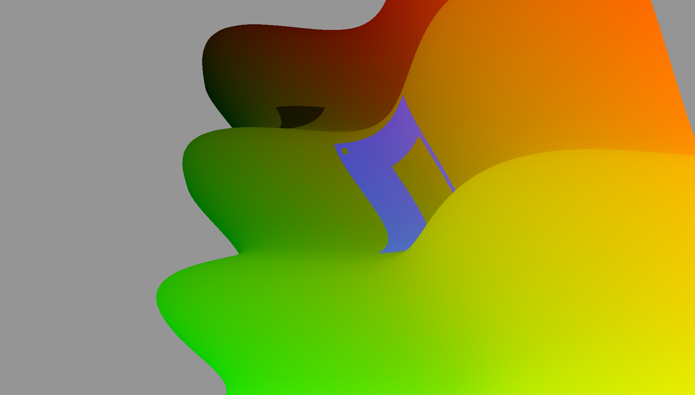

# gfx\_draping



> An example of this crate in action. Two semi-transparent polygons (a black
> triangle and a blue square with two holes in it) are rendered on a sinusoidal
> terrain.
>
> Note how the polygons rise and fall with the terrain, and can be partially
> occluded by a bump/mountain in the way.

This is a library for helping you draw polygons on a terrain. It uses a
screen-space algorithm based on the depth and stencil buffers, and performance
is affected only by the complexity of the polygons you're drawing not the
terrain it's drawn on.

This library is a Rust implementation the algorithm described by [Schneider &
Klein (2007)][sch2007], titled "Efficient and Accurate Rendering of Vector Data
on Virtual Landscapes".

For an example of what this crate can do, run the example:

```bash
# You'll want to zoom out to see anything. Do that by holding down CTRL and
# dragging down with your mouse. Then pan around with shift+drag.
cargo run --example demo
```

## Can I use this library?

You can, as long the following things are true:

* You are using `gfx` to do your graphics.
    * For now, only OpenGL is supported. But this is not a for any deep reason;
      it's just that the relevent shaders haven't been written. If you would
like to use another backend, PRs will kindly be accepted. :smile:
* You use the Z-Axis for your "up" in world-space -- that is, mountains go in
  the positive Z direction, and valleys go in the negative Z direction.

## How do I use this library?

Roughly speaking, it looks like this:

```rust
extern crate gfx_draping;

fn main() {
    // Step 1: Somehow, construct the polygon(s) you want to render.
    //
    // This polygon will be a square with a square hole inside of it.
    let polygon = vec![
        // A polygon is a sequence of rings; a ring is a list of points that
        // start and end with the same point.
        //
        // Note: although this list can contain multiple rings, it should only
        // contain a single polygon.

        // The first ring should be the exterior ring. It should be in
        // counter-clockwise winding order.
        (0.0, 0.0),
        (100.0, 0.0),
        (100.0, 100.0),
        (0.0, 100.0),
        (0.0, 0.0),

        // After the first (exterior) ring, what follows are interior "hole"
        // rings. These should be in clockwise winding order.
        (25.0, 25.0),
        (25.0, 75.0),
        (75.0, 75.0),
        (75.0, 25.0),
        (25.0, 25.0),

        // You could put more interior rings here
    ];

    // Step 2: Set up the draping renderer. You only need to do this once.
    let factory = however_you_get_your_gfx_factory();
    let draping_renderer = gfx_draping::DrapingRenderer::new(&mut factory);

    // Step 3: Prepare a drape-able version of your polygon. If your polygons
    // are static, you only need to do this once. If you ever change your
    // polygon's vertices, you must re-perform this action.
    //
    // If your terrain's elevation changes, there is no need to perform this
    // action again. Only changes to the polygon are relevant.

    // A (conservative -- too big is fine, too small will cause bugs) bounding
    // box for the polygon we're draping.
    let polygon_bounds = [
        // the minimum and maximum x-values ...
        (0.0, 100.0),
        // ... y-values ...
        (0.0, 100.0),
        // ... and z-values (this will depend on how you generate your terrain)
        (some_min_z, some_max_z),
    ];
    let drapeable_polygon =
        DrapeablePolygon::new_from_points(&mut factory, &polygon, &polygon_bounds);

    while your_game_loop() {
        // Step 4: Render your terrain, however it is you do that.
        clear_color_buffer();
        clear_depth_buffer();
        clear_stencil_buffer();
        render_terrain();

        // Step 5: Render the drapeable polygon.
        //
        // What's important here is that your depth buffer has the data from
        // your terrain. It's important that you don't clear your depth buffer
        // between `render_terrain` and the call(s) to DrapingRenderer::render.
        //
        // Also, don't draw buildings or other non-terrain stuff after rendering
        // your terrain, unless you want the polygons to drape over those
        // buildings too.
        draping_renderer.render(
            &mut window.encoder,
            window.output_color.clone(),
            window.output_stencil.clone(),
            get_model_view_projection(),
            [0.0, 0.0, 1.0, 0.5], // in RGBA format
            &drapeable_polygon,
        );
    }
}
```

## TODO:

If any of these problems interest you, open an issue or contact me, and I can
give you a hand. Or just open a PR if you're bold! :smile:

* Add support for non-OpenGL backends.
* Implement the z-pass algorithm described in Schneider (2007). This algorithm
  can be slightly faster, but can only be used when the bounding box of the
polygon doesn't intersect with the near plane of the view frustum. Currently,
only the z-fail method, which works in all cases, is currently implemented.

[sch2007]: http://cg.cs.uni-bonn.de/en/publications/paper-details/schneider-2007-efficient/
